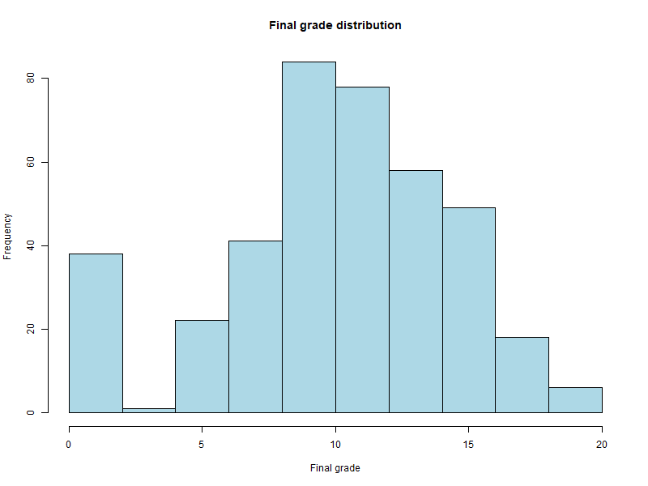
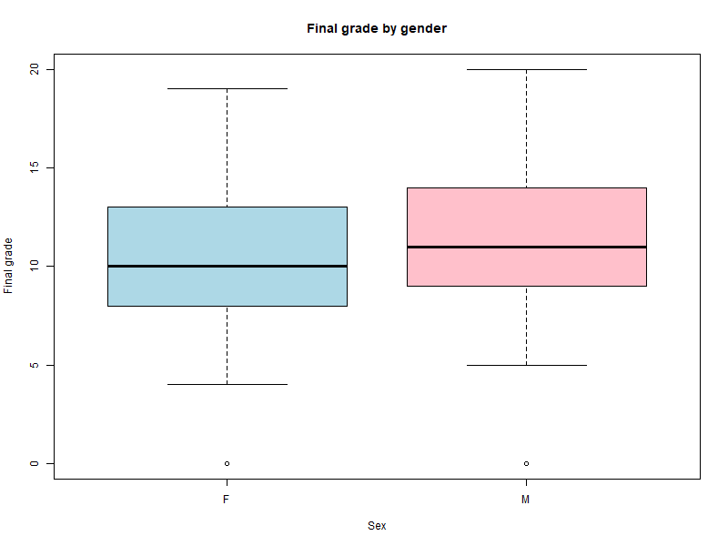
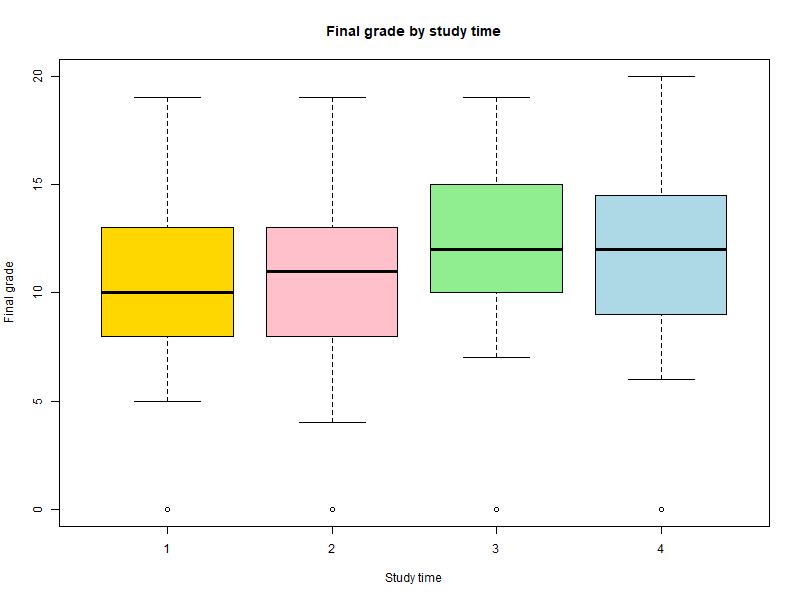

# r-student-grades-analysis
Exploratory data analysis of student performance using R

# Student Performance Analysis

This project analyzes factors associated with students final grades using a real student performance dataset.

The main goal of the analysis is to explore how personal, study-related factors influence student's grades.

---

## Tools

- RStudio

---
## Data Source
Data source: Kaggle - "Student Performance Dataset"
[https://www.kaggle.com/datasets/balavashan/students-performance-dataset](https://www.kaggle.com/datasets/devansodariya/student-performance-data/data)
## Data

The dataset contains information about students math course in secondary school, including:
- demographic characteristics (age, sex),
- social factors (romantic relationships, internet access, activities and etc.),
- study-related variables (study time, absences),
- final grade.

---

## Methods

The analysis was performed using base R and includes:
- Exploratory Data Analysis,
- Data visualization,
- Linear reggression modeling,
- Correlation analysis.

---

## Results

### Final Grade Distribution

The distribution of final grades shows that most of students study at an average level (between 9 to 12 points out of 20).

---

### Final Grade by  Gender

The boxplot shows differences in medians between male and female. Male students have a higher median final grade compared to female students, although the overall distribution largely the same..

---

### Final Grade by Study Time

Students who spend more time studying generally acieve higher final grades.

---

## Regression Analysis

A linear regression model shows associations between final grades and selected predictors:
- study time,
- age,
- romantic relationship,
- absences.

The results indicate that:
- students who study more time usually get better final grades,
- older students tend to have slightly lower grades,
- students who are not in romantic relationship achieveve slightly higher final grades, and boxplot shows that median is approximately the same,
- absences have a weak effect on final grade.

---

## Correlation Analysis

Pearson correlation analysis indicates:
- a weak negative correlation between age and final grade,
- a weak positive correlation between study time and final grade.

---

## Conclusion
This analysis shows that students final grades are influenced by multiple factors, but study habits play the most important role in academic performance.
This analysis shows that students final grades are influenced by multiple factors.
Study time appears to be the most important factor for better final grades. Age and romantic relationships have a smaller effect, while absences do not strongly influence final results.

It should be noted that this analysis is based on linear methods. Non-linear relationships may also be present.
